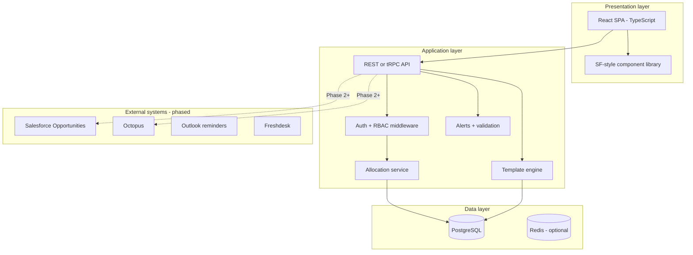
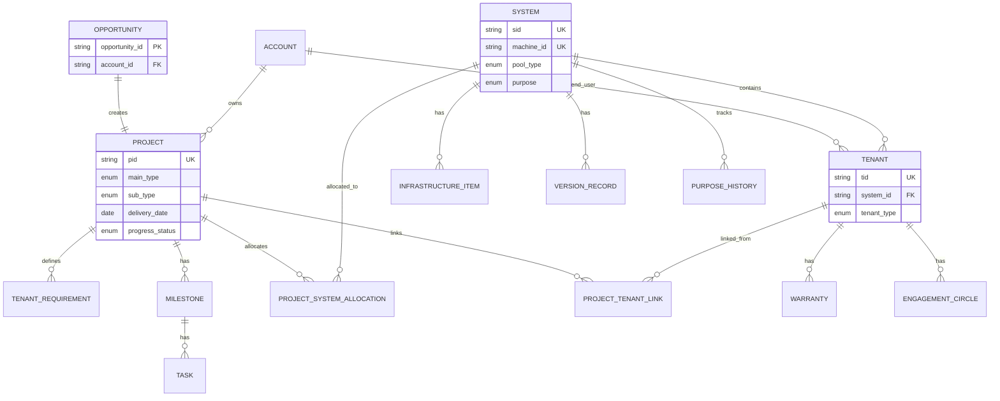
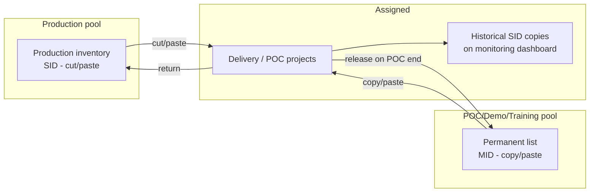
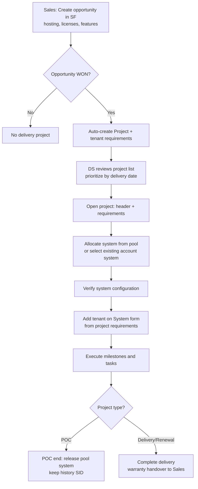
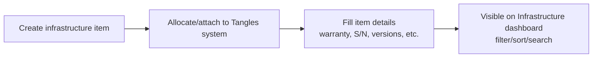
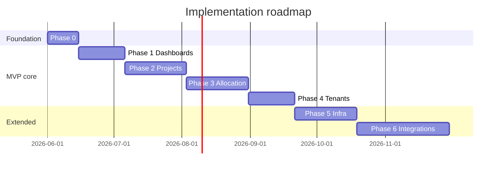

# Delivery Project Management — Design Document

**Version:** 1.0  
**Date:** 2026-05-25  
**Status:** Pre-implementation  
**Sources:** `General Code description.docx`, `Projects - SF design 24-05-26.xlsx`, `RE EXTERNAL Re Meeting #18 Phase 1 Upgrade Scheduler Manager meeting summary.msg`

---

## Table of contents

1. [Executive summary](#1-executive-summary)
2. [Architecture](#2-architecture)
3. [Entities and relationships](#3-entities-and-relationships)
4. [Workflows](#4-workflows)
5. [Forms and dashboards](#5-forms-and-dashboards)
6. [Tabs and sections](#6-tabs-and-sections)
7. [Database schema proposal](#7-database-schema-proposal)
8. [Implementation phases](#8-implementation-phases)
9. [MVP scope](#9-mvp-scope)
10. [Assumptions and gaps](#10-assumptions-and-gaps)
11. [Future enhancements](#11-future-enhancements)

---

## 1. Executive summary

### Purpose

This document defines the design for a **Salesforce-style Delivery Project Management** web application. The system supports Cobwebs/Pen-Link delivery operations: moving from a won sales opportunity through system allocation, tenant provisioning, milestones/tasks execution, and ongoing monitoring—evolving the current QB Project Management model.

### Core objects

| Object | Role |
|--------|------|
| **Project** | Delivery work unit created from a won opportunity; holds requirements, milestones, and system allocations |
| **System** | Infrastructure resource (production or POC/Demo/Training pool); allocated to projects, hosts tenants |
| **Tenant** | Customer or POC instance on a system; configuration, warranty (customer), or POC period (POC) |

### Required MVP dashboards

- **Project list** — delivery specialist desktop (priority, progress, dates)
- **System list** — customer/POC systems assigned to projects (commercial view)
- **Tenant list** — tenants on assigned systems with warranty-centric columns

### Design maturity (Phase 1, per meeting summaries)

| Milestone | Progress | Notes |
|-----------|----------|-------|
| Forms and object design | ~93–100% | Usage tab pending (Eyal) |
| Operational design | ~95% | Tenant alerts/notifications open |
| Dashboards design | 100% | Defined in meetings + Excel |
| Upgrade management | ~80% | Post-MVP |
| SF–Octopus integration | ~67% | Status doc pending |

### Key design principles

1. **Configuration-driven UI** — form layouts and visibility rules driven by metadata (seeded from Excel), not hard-coded per variant.
2. **Allocation as domain logic** — cut/paste (production) vs copy/paste (POC pool) enforced in a dedicated service layer.
3. **Salesforce-style UX** — dynamic multi-column headers, colored status rows, inline editable grids, linked PID/SID/TID navigation.
4. **Opportunity dependency** — correct Salesforce Opportunity data is a prerequisite for accurate project/tenant forms.

---

## 2. Architecture

### 2.1 High-level diagram



### 2.2 Technology recommendations

| Layer | Choice | Rationale |
|-------|--------|-----------|
| **Frontend** | React 18, TypeScript, TanStack Query, TanStack Table | Rich grids, inline edit, dynamic forms |
| **UI** | Custom SLDS-inspired design system | Explicit SF look-and-feel requirement |
| **Forms** | React Hook Form + Zod + metadata-driven renderer | Six project variants, conditional sections |
| **API** | Node (NestJS/Fastify) or .NET | Strong validation for allocation invariants |
| **ORM** | Prisma or Drizzle | Migrations, type-safe queries |
| **Database** | PostgreSQL | Relational model, JSONB for flexible config |
| **Auth** | Azure AD / SSO + app RBAC | Aligns with SF user lists for engagement circles |
| **Audit** | `form_audit_log` table + row versioning | “Last changed by” on every form |

### 2.3 Cross-cutting concerns

| Concern | Approach |
|---------|----------|
| **Permissions** | Role-based; partial field write per QB PM 6.0 matrix (when available) |
| **Regional filtering** | Dashboard auto-filter by user region/ownership |
| **Export** | All grids → CSV via API |
| **Codenames** | Customer real names only for permitted users |
| **Audit trail** | User + full timestamp on every form change |
| **Read models** | Dashboard DTOs / views optimized for filtered list queries |

### 2.4 Repository structure (proposed)

```
delivery-project-management/
├── apps/
│   ├── web/                 # React frontend
│   └── api/                 # Backend API
├── packages/
│   ├── shared/              # Types, Zod schemas, enums
│   └── form-metadata/       # Field/tab templates from Excel
├── prisma/ or drizzle/      # Schema + migrations
└── DESIGN.md
```

---

## 3. Entities and relationships

### 3.1 Entity relationship diagram



### 3.2 Entity definitions

#### Project

| Attribute | Description |
|-----------|-------------|
| **PID** | Auto-generated primary business key (e.g. `P1235`) |
| **main_type** | `POC` \| `DELIVERY` \| `RENEWAL` |
| **sub_type** | `NONE` \| `NEW` \| `UPSELL` \| `STANDARD` \| `DOWN_SELL` |
| **Opportunity** | 1:1 link; read-only fields derived from SF |
| **Progress** | `OPEN` \| `IN_PROGRESS` \| `DONE` (from tasks) |
| **Delivery date** | From opportunity; editable by authorized roles on delivery projects |

#### System

| Attribute | Description |
|-----------|-------------|
| **SID** | Auto-generated for production; temporary per POC assignment from pool |
| **MID (Machine ID)** | Primary key in POC/Demo/Training pool (e.g. `p202`) |
| **pool_type** | Production inventory, POC/Demo/Training pool, delivery-assigned, POC-assigned |
| **purpose** | `AVAILABLE`, `POC`, `DEMO`, `TRAINING`, `SUPPORT`, `CUSTOMER` |
| **availability** | `AVAILABLE`, `OCCUPIED`, `OBSOLETE` |

#### Tenant

| Attribute | Description |
|-----------|-------------|
| **TID** | Auto-generated (e.g. `T1234`) |
| **Composite display** | `TID+SID+PID` when system and project linked; else `Not set yet` |
| **tenant_type** | `CUSTOMER`, `POC`, `PENLINK_INTERNAL` |
| **configuration** | Product, hosting, licenses, feature flags (JSONB) |

### 3.3 Relationship rules

| Rule | Detail |
|------|--------|
| Opportunity → Project | **1:1** when opportunity is WON |
| System ↔ Project | **Many-to-many** via allocation; system is a **resource**, not contained in project |
| Tenant → System | **Many-to-one**; tenant must belong to exactly one system |
| Tenant ↔ Project | Linked via requirements and `project_tenant_links` |
| System ↔ Tenant | One system may host **multiple tenants** (multi-tenant); ~95% cases are 1:1 |
| Tenant move | Cut/paste between systems allowed (permission-gated) |
| System move | Cut/paste between projects or back to pool (permission-gated) |
| Warranty | Per **tenant** (customer) and per **infrastructure item** |

### 3.4 Project type taxonomy

| Main type | Sub type | Form sheet (Excel) |
|-----------|----------|-------------------|
| **POC** | — | Project Form – POC |
| **Delivery** | New | Project Form – Delivery-New |
| **Delivery** | Upsell | Project form – Delivery-Upsell |
| **Renewal** | Standard | Project form – Renewal-Standard |
| **Renewal** | Upsell | Project form – Renewal-Upsell |
| **Renewal** | Down sell | Project form – Renewal-Down Sell |

All project types **must** provide tenant requirements (variant tables differ).

### 3.5 System pool model



| Pool | Behavior when assigned | When released |
|------|------------------------|---------------|
| **Production inventory** | System **removed** from pool (cut/paste) | Cut/paste back to inventory |
| **POC/Demo/Training** | System **stays** in pool; marked OCCUPIED | Set AVAILABLE; historical SID retained on dashboard |

---

## 4. Workflows

### 4.1 Master delivery flow



### 4.2 System allocation workflows

| ID | Workflow | Mechanism | Preconditions |
|----|----------|-----------|---------------|
| W-S01 | Production → project | Cut/paste from inventory | DS permission; system in inventory |
| W-S02 | Project → production inventory | Cut/paste back | Deallocate from project |
| W-S03 | Project ↔ project (production) | Cut/paste between projects | Both delivery contexts |
| W-S04 | POC pool → POC project | Copy/paste; new temporary SID | Available POC/Demo/Training system |
| W-S05 | POC project → pool | Remove; set AVAILABLE | POC ended or manual release |
| W-S06 | POC project ↔ POC project | Cut/paste | Permission-gated |
| W-S07 | System creation request | SF workflow / DS direct create | Special cases: Azure Gov, on-prem, etc. |

**Allocation dialog options (from Excel):**

| Context | Option 1 | Option 2 |
|---------|----------|----------|
| Production | Open product systems list (cut/paste) | Account-scoped production systems for project account |
| POC | Open available POC/Demo/Training list (copy/paste) | Account-scoped production systems (Sales POC on existing customer system) |

### 4.3 Tenant lifecycle workflows

| ID | Workflow | Steps |
|----|----------|-------|
| W-T01 | Create tenant from requirement | Project linked to system → System form → Add tenant → select requirement source |
| W-T02 | Tenant move | Cut/paste tenant to different system |
| W-T03 | Tenant remove | Deallocate from system (e.g. end of warranty) |
| W-T04 | Product type validation | **Block** if tenant product ≠ system product |
| W-T05 | Time group warning | **Warn** if tenant geo time group ≠ system; allow CANCEL or ASSIGN |
| W-T06 | Penlink internal tenant | DS may create internal tenant on system with type = Penlink |

### 4.4 Project-type requirement workflows

| Project type | Requirement tables shown | Max tables |
|--------------|-------------------------|------------|
| POC | New tenant only | 1 |
| Delivery – New | New tenant only | 1 |
| Delivery – Upsell | New only / Change only / Both | 2 |
| Renewal – Standard | Standard renewal (auto on System & Tenant tab) | 1 |
| Renewal – Upsell | Change, New, Standard combinations | up to 3 |
| Renewal – Down sell | Change + Standard, or Standard only | up to 2 |

**Auto-population rules:**

- Change-request tenants/systems → appear on **System and Tenant** tab when project is created.
- Standard renewal selections → appear on **System and Tenant** tab when project is created.
- Change-request may auto-allocate existing systems per opportunity rules.

### 4.5 Milestones and tasks

| Rule | Detail |
|------|--------|
| Tabs | **Milestones** and **Tasks** are separate tabs |
| Template selection | Lookup: `(main_type, sub_type)` → Milestone template #1–#8 |
| Task creation | Tasks only via milestone (milestone form) |
| Milestone status | Open → In progress → Done (icons + progress bar) |
| POC close | All tasks DONE → POC officially closed → pool release + Freshdesk ticket |

### 4.6 Infrastructure item workflow



- Two sub-tabs on System form: **General info** and **Environment items**.
- Create first, then allocate (same pattern as today in QB).

### 4.7 Documented workflow inventory (~18)

Meetings reference **18 operational workflows** including:

1. POC delivery  
2. POC extension  
3. POC ending (pool + history)  
4. Delivery – New  
5. Delivery – Upsell  
6. Renewal – Standard  
7. Renewal – Upsell  
8. Renewal – Down sell  
9. Tenant change request  
10. New tenant + change request combinations  
11. Production pool management  
12. POC/Demo/Training pool management  
13. System creation request  
14. Infrastructure item create/allocate  
15. Upgrade scheduler (system-centric)  
16. Tenant alerts/notifications  
17. Permissions / partial write  
18. SF–Octopus connectivity  

---

## 5. Forms and dashboards

### 5.1 Global form shell (all record types)

Every record form shares:

| Element | Description |
|---------|-------------|
| **Sticky title** | `PID #…` / `SID …` / `TID …` |
| **Dynamic header** | Multi-column fields grouped by category |
| **Tab bar** | Variant-specific tabs (see §6) |
| **Audit footer** | “Last updated by {user} at {datetime}” |
| **Actions** | Contextual (e.g. Cancel project, Add tenant, Allocate system) |

### 5.2 Project forms (6 variants)

Driven by Excel sheets; common elements:

| Element | Behavior |
|---------|----------|
| Header | Opportunity, Account, Delivery date, Owners, Progress, Alerts |
| §3 Tenant requirements | 1–3 dynamic tables |
| Milestones tab | Template-driven grid |
| Tasks tab | Child of milestones |
| System and Tenant tab | Allocated systems + tenants; manual system add |
| Engagement circles | Stakeholder grid |
| Remarks | Optional rich-text grid |
| Cancel | Mandatory `cancellation_reason` |

**Read-only alerts (examples):**

- Delivery date missing / overdue  
- POC end date overdue  
- Delivery/start date missing / overdue  

### 5.3 System forms (2 variants)

| Variant | Excel sheet | Primary use |
|---------|-------------|-------------|
| Customer (Production) | System form – Customer | One-time customer systems |
| POC/Demo/Training | System form – POC-Demo-Training | Reusable pool systems |

### 5.4 Tenant forms (2 variants)

| Variant | Excel sheet | Key difference |
|---------|-------------|----------------|
| Customer | Tenant form – Customer | **Warranties** tab (record list) |
| POC | Tenant form – POC | **POC Start/End dates** instead of warranties |

**Shared:** Configuration tab (default), Engagement circles, Configuration history, Events/activity log.

### 5.5 Dashboard catalog

#### MVP dashboards (required)

| Dashboard | Primary key | Audience / purpose |
|-----------|-------------|-------------------|
| **Project list** | PID | DS desktop: priority, progress, delivery dates |
| **System list** | SID (+ MID for POC) | Customer/POC systems on projects; commercial view |
| **Tenant list** | TID | Tenants with warranty columns (initial, start, end, status) |

#### Full design dashboards (post-MVP or parallel)

| # | Dashboard | Key | Purpose |
|---|-----------|-----|---------|
| 4 | Production repository | SID | Inventory only; cut/paste source for new systems |
| 5 | POC/DEMO/Training pool | MID | Pool management; copy/paste source |
| 6 | Infrastructure items | Item ID | Cross-system hardware/software warranty monitoring |
| 7 | Upgrade Scheduler | SID | Active/under-warranty systems; upgrade calendar |
| 8 | Executive reports | — | Management reporting (Excel sheet exists) |

#### Shared dashboard UX requirements

| Feature | Specification |
|---------|---------------|
| **Counter** | Total visible rows at top; updates with filters |
| **Filters** | Picklist from column values (not free text) |
| **Dynamic filters** | One filter control per visible column |
| **Group by** | A–Z / Z–A with per-group counts |
| **Search** | Free text across all cells; filters rows |
| **Inline edit** | Permission-dependent |
| **Replace all** | Text fields only (some dashboards) |
| **Export** | CSV for all tables |
| **Row coloring** | By status/purpose |
| **Layouts** | Default layouts immutable; users may copy to custom views |
| **Scope** | Systems/tenants on projects assigned since day 1; POC copies remain visible after pool release |

#### Dashboard field placement rules (Meeting #15)

| Dashboard | Warranty fields | Machine ID |
|-----------|-------------------|--------------|
| System and POC | **Removed** | Added (POC) |
| Tenant | **Included** (derived from first warranty record) | — |
| POC/DEMO/Training pool | N/A (technical fields) | Primary key MID |

---

## 6. Tabs and sections

### 6.1 Project form tabs and sections

| Order | Section / tab | Content |
|-------|---------------|---------|
| 1 | Sticky title | `PID #xxxx` |
| 2 | Header | Multi-column: opportunity, account, dates, owners, progress, alerts |
| 3 | Tenant requirements | Dynamic tables: New / Change request / Standard |
| 4 | Milestones | Template-based milestone grid |
| 5 | Tasks | Tasks linked to milestones |
| 6 | System and Tenant | Allocated systems; existing tenants; allocation UI |
| 7 | Engagement circles | Role → user mapping |
| 8 | Remarks | Optional notes grid |

**Tenant requirement table fields (representative):**

| Field group | Examples |
|-------------|----------|
| Identity | Account, New system (boolean), SID if existing |
| Product | Tangles, Tangles Light, Webloc, Weaver, Trapdoor, Lynx, DataAPI |
| Hosting | On prem, Cloud, Hybrid, Azure Gov, Environment |
| Capacity | Licenses, users, Webloc users, daily/monthly quotas |
| Features | SSO, 2FA, Export PDF, Enhanced Search, Post Translation (multi-select) |
| Domains / access | Domain list, IP restriction, external interfaces |
| Commercial | Freshdesk accounts, warranty/service period |

### 6.2 System form tabs and sections

| Tab | Sub-sections | Notes |
|-----|--------------|-------|
| **Header** | Linked PIDs list, core system attributes | Always visible |
| **Tenants** | Tenant grid + Add/Edit/Delete/Move | Tenant created here, not on project |
| **Version update** | Version record grid | Customer systems; POC may use column instead |
| **Infrastructure** | General info; Environment items | See below |
| **Usage** | BI / usage reports | *Deferred — design with Eyal* |
| **Documents** | Attachments / links | |
| **POC Period** | Start/end dates | POC systems only |
| **Purpose history** | Grid: purpose, duration, project ID | POC/Demo/Training only |
| **Owner** | Training/demo owner | POC/Demo/Training only |

#### Infrastructure tab structure

| Sub-tab | Content |
|---------|---------|
| **General info** | Hosting (cloud/on-prem), CSP, cloud region, platform, VPN, firewall, IP restriction, performance tier, etc. |
| **Environment items** | List of hardware/software items; drill-in form per item (ESXi version, S/N, warranty, disks, firmware, maintenance) |

Categories include: Server, Storage, Backup, ESXi, Firewall (FortiGate, Cisco, WAF, Open VPN), Agent, etc. Conditional fields appear based on item type.

### 6.3 Tenant form tabs and sections

| Tab | Customer | POC |
|-----|----------|-----|
| **Configuration** (default) | Product, hosting, licenses, features | Same |
| **Warranties** | Record list with predecessor chain, statuses | — |
| **POC Period** | — | Start/end (from project; editable for permitted users) |
| **Engagement circles** | SF user picklists by role | Same |
| **Configuration history** | Audit trail | Same |
| **Events / activity** | Type, datetime, user, note, calendar, optional Outlook flag | Same |

**Tenant header fields (representative):**

| Field | Behavior |
|-------|----------|
| TID | Primary link |
| SID | Link to system form |
| MID | Machine number (column) |
| PID | Link when allocated to project |
| Account | Picklist |
| Country / Time zone / Time group | Auto-derived; alerts on mismatch |
| Operational status | Picklist + auto rules |
| Warranty status (customer) | Formula from warranty records |
| Version number | Column (replaces Version tab on tenant) |

### 6.4 Milestone template mapping

Configured in Excel **Milestones and Tasks Template** + **Project form – general** lookup:

| Template | Typical project binding |
|----------|-------------------------|
| #1 | POC |
| #2 | Delivery – New |
| #3 | Delivery – Upsell (variant) |
| #4 | Renewal – Standard |
| #5–#6 | Renewal – Upsell combinations |
| #7–#8 | Renewal – Down sell / extended renewal |

Exact milestone/task names are seeded from the Excel template sheet during implementation.

### 6.5 Requirement type lookup (Project form – general)

| Code | Meaning | Typical visibility |
|------|---------|-------------------|
| A | New tenant requirements only | Delivery New, POC |
| B | Change request only | Upsell/Down sell variants |
| C | Standard renewal | Renewal variants |
| A & B | New + Change request | Delivery Upsell |
| A & B (& C) | All three | Renewal Upsell (up to 3 tables) |
| B & C | Change + Standard | Renewal Down sell |

---

## 7. Database schema proposal

### 7.1 Enum types

```sql
CREATE TYPE project_main_type AS ENUM ('POC', 'DELIVERY', 'RENEWAL');
CREATE TYPE project_sub_type AS ENUM ('NONE', 'NEW', 'UPSELL', 'STANDARD', 'DOWN_SELL');
CREATE TYPE progress_status AS ENUM ('OPEN', 'IN_PROGRESS', 'DONE');
CREATE TYPE system_pool_type AS ENUM (
  'PRODUCTION_INVENTORY', 'POC_DEMO_TRAINING', 'DELIVERY_ASSIGNED', 'POC_ASSIGNED'
);
CREATE TYPE system_purpose AS ENUM (
  'AVAILABLE', 'POC', 'DEMO', 'TRAINING', 'SUPPORT', 'CUSTOMER'
);
CREATE TYPE availability_status AS ENUM ('AVAILABLE', 'OCCUPIED', 'OBSOLETE');
CREATE TYPE tenant_type AS ENUM ('CUSTOMER', 'POC', 'PENLINK_INTERNAL');
CREATE TYPE requirement_kind AS ENUM ('NEW', 'CHANGE_REQUEST', 'STANDARD_RENEWAL');
CREATE TYPE allocation_type AS ENUM ('CUT', 'COPY');
CREATE TYPE warranty_status AS ENUM (
  'NOT_SET', 'PLANNED', 'VALID', 'PENDING', 'RENEWED', 'EXPIRED', 'NO_WARRANTY', 'OBSOLETE'
);
```

### 7.2 Core tables

| Table | Purpose |
|-------|---------|
| `accounts` | End-user / customer accounts |
| `opportunities` | SF opportunity snapshot |
| `projects` | Delivery projects (PID) |
| `systems` | Systems (SID, MID, pool metadata) |
| `project_system_allocations` | Project ↔ system allocation history |
| `tenants` | Tenants (TID) on systems |
| `project_tenant_links` | Project ↔ tenant association |
| `tenant_requirements` | Requirement tables per project |
| `milestones` | Project milestones |
| `tasks` | Milestone tasks |
| `warranties` | Tenant or infrastructure warranties |
| `engagement_circles` | Tenant stakeholder roles |
| `infrastructure_items` | Environment items per system |
| `system_version_records` | Version history per system |
| `tenant_configuration_history` | Config change audit |
| `system_purpose_history` | POC pool usage history |
| `form_audit_log` | Generic entity change log |

### 7.3 Key table definitions

```sql
CREATE TABLE projects (
  id              UUID PRIMARY KEY DEFAULT gen_random_uuid(),
  pid             VARCHAR(32) NOT NULL UNIQUE,
  opportunity_id  UUID UNIQUE REFERENCES opportunities(id),
  account_id      UUID NOT NULL REFERENCES accounts(id),
  main_type       project_main_type NOT NULL,
  sub_type        project_sub_type NOT NULL DEFAULT 'NONE',
  name            VARCHAR(255),
  delivery_date   DATE,
  warranty_service_months INTEGER,
  progress_status progress_status NOT NULL DEFAULT 'OPEN',
  canceled_at     TIMESTAMPTZ,
  cancellation_reason TEXT,
  created_at      TIMESTAMPTZ NOT NULL DEFAULT now(),
  updated_at      TIMESTAMPTZ NOT NULL DEFAULT now(),
  created_by      UUID NOT NULL,
  updated_by      UUID NOT NULL
);

CREATE TABLE systems (
  id              UUID PRIMARY KEY DEFAULT gen_random_uuid(),
  sid             VARCHAR(32) UNIQUE,
  machine_id      VARCHAR(32) UNIQUE,
  pool_type       system_pool_type NOT NULL,
  system_class    VARCHAR(32) NOT NULL,
  purpose         system_purpose NOT NULL DEFAULT 'AVAILABLE',
  availability    availability_status NOT NULL DEFAULT 'AVAILABLE',
  account_id      UUID REFERENCES accounts(id),
  product_type    VARCHAR(64),
  hosting_type    VARCHAR(64),
  time_group      VARCHAR(64),
  operational_status VARCHAR(64),
  configuration   JSONB NOT NULL DEFAULT '{}',
  created_at      TIMESTAMPTZ NOT NULL DEFAULT now(),
  updated_at      TIMESTAMPTZ NOT NULL DEFAULT now()
);

CREATE TABLE project_system_allocations (
  id              UUID PRIMARY KEY DEFAULT gen_random_uuid(),
  project_id      UUID NOT NULL REFERENCES projects(id),
  system_id       UUID NOT NULL REFERENCES systems(id),
  allocation_type allocation_type NOT NULL,
  allocated_at    TIMESTAMPTZ NOT NULL DEFAULT now(),
  deallocated_at  TIMESTAMPTZ,
  allocated_by    UUID NOT NULL
);

CREATE TABLE tenants (
  id              UUID PRIMARY KEY DEFAULT gen_random_uuid(),
  tid             VARCHAR(32) NOT NULL UNIQUE,
  system_id       UUID NOT NULL REFERENCES systems(id),
  tenant_type     tenant_type NOT NULL,
  account_id      UUID REFERENCES accounts(id),
  country         VARCHAR(64),
  timezone        VARCHAR(64),
  time_group      VARCHAR(64),
  operational_status VARCHAR(64),
  product_type    VARCHAR(64),
  configuration   JSONB NOT NULL DEFAULT '{}',
  poc_start_date  DATE,
  poc_end_date    DATE,
  created_at      TIMESTAMPTZ NOT NULL DEFAULT now(),
  updated_at      TIMESTAMPTZ NOT NULL DEFAULT now()
);
```

### 7.4 Configuration and templates

```sql
CREATE TABLE project_type_template_map (
  main_type               project_main_type NOT NULL,
  sub_type                project_sub_type NOT NULL,
  milestone_template_id   INTEGER NOT NULL,
  show_new_requirements   BOOLEAN NOT NULL DEFAULT false,
  show_change_request     BOOLEAN NOT NULL DEFAULT false,
  show_standard_renewal   BOOLEAN NOT NULL DEFAULT false,
  PRIMARY KEY (main_type, sub_type)
);

CREATE TABLE milestone_templates (
  id          SERIAL PRIMARY KEY,
  code        VARCHAR(32) NOT NULL UNIQUE,
  name        VARCHAR(128) NOT NULL
);

CREATE TABLE milestone_template_items (
  id            SERIAL PRIMARY KEY,
  template_id   INTEGER NOT NULL REFERENCES milestone_templates(id),
  name          VARCHAR(255) NOT NULL,
  sort_order    INTEGER NOT NULL
);

CREATE TABLE task_template_items (
  id                      SERIAL PRIMARY KEY,
  milestone_template_item_id INTEGER NOT NULL REFERENCES milestone_template_items(id),
  name                    VARCHAR(255) NOT NULL,
  sort_order              INTEGER NOT NULL
);
```

### 7.5 Index strategy

| Index | Purpose |
|-------|---------|
| `projects(delivery_date, progress_status)` | Project list sorting/filtering |
| `projects(account_id)` | Account-scoped queries |
| `systems(pool_type, availability)` | Pool dashboards |
| `systems(machine_id)` | POC pool lookups |
| `tenants(system_id)` | System form tenant grid |
| `project_system_allocations(system_id) WHERE deallocated_at IS NULL` | Active allocations |
| `warranties(tenant_id, status)` | Tenant dashboard warranty columns |

### 7.6 JSONB usage

| Entity | JSONB field | Contents |
|--------|-------------|----------|
| `projects` | — | Structured columns preferred for reporting |
| `systems.configuration` | Hosting details, regions, URLs |
| `tenants.configuration` | Licenses, features, domains |
| `tenant_requirements.payload` | Full requirement row from project form |
| `infrastructure_items.details` | Category-specific fields (disks, firmware, etc.) |
| `form_audit_log.diff` | Field-level change snapshot |

---

## 8. Implementation phases

### Phase 0 — Foundation (1–2 weeks)

| # | Deliverable |
|---|-------------|
| 0.1 | Stakeholder sign-off on MVP vs full dashboard scope |
| 0.2 | Parse Excel → `form-metadata` package (fields, tabs, visibility rules) |
| 0.3 | Monorepo scaffold (`web`, `api`, `shared`) |
| 0.4 | PostgreSQL schema v1 + migrations |
| 0.5 | Auth + RBAC skeleton |
| 0.6 | Seed `project_type_template_map` + milestone templates #1–#8 |

### Phase 1 — Read paths and dashboards (2–3 weeks)

| # | Deliverable |
|---|-------------|
| 1.1 | CRUD read APIs for Project, System, Tenant |
| 1.2 | **Project list**, **System list**, **Tenant list** dashboards |
| 1.3 | Filters, counter, group-by, search, CSV export |
| 1.4 | Record shell: sticky header + linked PID/SID/TID navigation (read-only) |

### Phase 2 — Project forms (3–4 weeks)

| # | Deliverable |
|---|-------------|
| 2.1 | Metadata-driven project form renderer (6 variants) |
| 2.2 | Tenant requirements tables with conditional visibility |
| 2.3 | Milestones + Tasks tabs; template instantiation on create |
| 2.4 | System and Tenant tab; auto-population rules |
| 2.5 | Project alerts + Cancel project flow |
| 2.6 | Form audit footer |

### Phase 3 — System pools and allocation (3–4 weeks)

| # | Deliverable |
|---|-------------|
| 3.1 | Allocation service (cut/paste vs copy/paste invariants) |
| 3.2 | Production inventory dashboard (if in scope) |
| 3.3 | POC/Demo/Training pool dashboard (if in scope) |
| 3.4 | System forms (Customer + POC) with Tenants tab |
| 3.5 | Add-tenant-from-requirement flow |
| 3.6 | Product-type block + time-group warning |
| 3.7 | Move tenant; return system to pool |

### Phase 4 — Tenant forms and warranty (2–3 weeks)

| # | Deliverable |
|---|-------------|
| 4.1 | Tenant Customer form + warranties engine |
| 4.2 | Tenant POC form + POC period |
| 4.3 | Engagement circles |
| 4.4 | Configuration history |

### Phase 5 — Infrastructure and permissions (3–4 weeks)

| # | Deliverable |
|---|-------------|
| 5.1 | System Infrastructure tab (General + Environment items) |
| 5.2 | Infrastructure global dashboard |
| 5.3 | Field-level partial write permissions |
| 5.4 | Tenant alerts (once use cases defined) |

### Phase 6 — Integrations and hardening (ongoing)

| # | Deliverable |
|---|-------------|
| 6.1 | Salesforce Opportunity → Project on WON |
| 6.2 | Upgrade Scheduler module |
| 6.3 | Usage tab |
| 6.4 | Octopus integration |
| 6.5 | Executive reports |
| 6.6 | Critical design pass (18 workflows end-to-end) |

### Timeline estimate

| Scope | Duration (small team) |
|-------|----------------------|
| **MVP** (§9) | ~12–16 weeks |
| **Full Phase 1 design** | +8–12 weeks |



---

## 9. MVP scope

### 9.1 In scope

| Area | MVP includes |
|------|----------------|
| **Objects** | Project, System, Tenant (full CRUD for core fields) |
| **Dashboards** | Project list, System list, Tenant list |
| **Project types** | All 6 form variants with requirements + milestones/tasks |
| **Allocation** | Production cut/paste + POC copy/paste (minimal pool UIs or simplified picker) |
| **System form** | Customer + POC variants; Tenants tab; basic header |
| **Tenant form** | Customer + POC variants; Configuration + warranty/POC period |
| **Rules** | Product-type block, time-group warning, progress from tasks, cancel project |
| **UX** | SF-style header, inline grids, CSV export, linked IDs, audit footer |
| **Auth** | Login + basic roles (DS, read-only, admin) |

### 9.2 Out of scope (MVP)

| Area | Target phase |
|------|----------------|
| Upgrade Scheduler Manager | Phase 6 |
| Infrastructure tab + global dashboard | Phase 5 |
| Usage tab (system + tenant) | Phase 6 |
| Executive reports | Phase 6 |
| SF–Octopus integration | Phase 6 |
| Tenant alerts/notifications (undefined use cases) | Phase 5+ |
| Outlook reminder automation | Phase 6 |
| Custom user-defined dashboard layouts | Post-MVP |
| Full production/POC pool management UIs | Phase 3 (may be simplified in MVP to modals) |

### 9.3 MVP success criteria

1. DS can open **Project list**, prioritize by delivery date, and open a project.  
2. DS can complete **Delivery – New** flow: requirements → allocate system → add tenant → complete tasks.  
3. DS can complete **POC** flow: copy system from pool → tenant → close POC → release to pool.  
4. **Tenant list** shows warranty status; **System list** shows assignment without warranty columns.  
5. All three dashboards support filter, search, export, and record navigation.  
6. Form layouts match Excel metadata for header, tabs, and primary field groups.

---

## 10. Assumptions and gaps

### 10.1 Assumptions

| ID | Assumption |
|----|------------|
| A-01 | Salesforce Opportunity will be extended to supply all fields marked “derived from opportunity” in Excel |
| A-02 | PID, SID, TID generation rules match existing QB sequential patterns |
| A-03 | Users authenticate via corporate SSO (Azure AD or equivalent) |
| A-04 | SF user directory is available for Engagement circle picklists (or stubbed with manual entry in MVP) |
| A-05 | One timezone/locale per user for date/time display |
| A-06 | English-only UI for MVP |
| A-07 | Single-tenant deployment (one organization) |
| A-08 | Metadata from Excel is stable enough to seed; changes go through migration/seed updates |

### 10.2 Open gaps

| ID | Gap | Impact | Owner / action |
|----|-----|--------|----------------|
| G-01 | **QB PM 6.0 roles/permissions matrix** not in repo | Cannot finalize partial-write field map | Locate document; map to RBAC |
| G-02 | **Tenant alerts use cases** not defined | Alerts engine incomplete | Workshop during Phase 5 |
| G-03 | **SF Opportunity field contract** not documented | Read-only derivations may be wrong | Align with SF admin |
| G-04 | **Octopus integration status** unknown | Phase 6 scope unclear | Alex overview + meeting |
| G-05 | **Usage tab design** pending | System/tenant Usage deferred | Session with Eyal |
| G-06 | **Milestone templates #1–#8** task names in Excel need machine extraction | Seed data incomplete | Parse `Milestones and Tasks Template` sheet |
| G-07 | **Wizard vs QB-style navigation** for operational flows | UX implementation choice | Product decision |
| G-08 | **Infrastructure “Item” category** additions from Roman | Schema/metadata update | Follow-up meeting |
| G-09 | **Upgrade Scheduler** Inbar review pending | May add fields/workflows | Meeting with Inbar/Omri |
| G-10 | **Freshdesk ticket** on POC end — API vs manual | Automation scope | Integrate or document manual step |

### 10.3 Risks

| Risk | Mitigation |
|------|------------|
| Excel layouts change during build | Metadata-driven forms; versioned seed files |
| SF integration delayed | Manual project creation + CSV import fallback for MVP |
| Scope creep from 8 dashboards | Strict MVP boundary (§9); phase gates |
| Complex warranty predecessor logic | Dedicated warranty sub-service + unit tests |
| POC history + pool state divergence | Allocation service as single source of truth |

### 10.4 Source traceability

| Design area | Primary source |
|-------------|----------------|
| Objects, relationships, baseline workflow | `General Code description.docx` |
| Form layouts, fields, templates, lookup tables | `Projects - SF design 24-05-26.xlsx` |
| Operational workflows, dashboards, infra, upgrade | Meeting summary `.msg` |
| Permissions reference | QB Project Management 6.0 (external doc) |

---

## 10.5 Critical design phase (post-implementation)

Original plan **Stage #2 — Critical design** validates:

- UI/UX gaps  
- Wrong object/form connectivity  
- Missing fields/data  
- Roles vs permissions verification  
- Automation gaps  

Run against all **18 workflows** before production rollout.

---

## 11. Future enhancements

### 11.1 Near term (Phase 5–6)

| Enhancement | Description |
|-------------|-------------|
| **Upgrade Scheduler** | System-centric calendar; region-filtered dashboards; Sales/CS slot selection; engineer assignment; version record on complete |
| **Infrastructure dashboard** | Global item list; visual compare product warranty end vs item warranty |
| **Usage analytics** | Embedded BI for system/tenant usage (with Eyal) |
| **SF–Octopus sync** | Provisioning/deployment automation from opportunity/delivery data |
| **Tenant notifications** | Rules for unassigned tenant, warranty expiry, time-group mismatch, etc. |
| **Outlook reminders** | Task deadline reminders via Outlook |

### 11.2 Medium term

| Enhancement | Description |
|-------------|-------------|
| **Executive reports** | Cross-project KPIs, delivery throughput, POC conversion |
| **Wizard flows** | Guided DS flows for complex Delivery Upsell / Renewal Upsell |
| **Custom dashboard copies** | User clones of default layouts (defaults remain protected) |
| **Replace-all bulk edit** | CTRL+H equivalent on dashboard text columns |
| **Canceled systems report** | Dedicated view for canceled projects’ systems |
| **Domain management** | TS domain list integration with add/link/report grid |

### 11.3 Long term

| Enhancement | Description |
|-------------|-------------|
| **Full Salesforce embedded UI** | Lightning/outbound integration if console lives inside SF |
| **Mobile-responsive DS views** | Priority project list for on-call DS |
| **AI-assisted allocation** | Suggest system/tenant placement based on requirements |
| **Multi-region tenancy** | Data residency per region |
| **Customer portal read-only** | Limited warranty/status view for end customers |
| **Phase 2 effort/cost estimation module** | Per original project plan after Stage #1 sign-off |

---

## Appendix A — Warranty status rules

| Status | Condition |
|--------|-----------|
| **Not set yet** | Warranty ID exists but start/end empty |
| **Planned** | Start date in the future |
| **Valid** | Today between start and end |
| **Pending** | End date within 90 days |
| **Renewed** | Has successor warranty via predecessor |
| **Expired** | Past end date |
| **No warranty** | Explicit boolean on record |
| **Obsolete** | Manual flag |

Tenant operational status derives from warranty tab (customer) or POC period (POC): e.g. *Need to renew*, *Not set yet*, *Within POC period*, *Exceeded POC period* (alert).

---

## Appendix B — Product and feature reference

**Products:** Tangles, Tangles Light, Webloc, Weaver, Trapdoor, Lynx, DataAPI  

**Common feature flags (multi-select):** SSO, 2FA, Export to PDF, Enhanced Search, Post Translation  

**Hosting types:** On prem, Cloud, Hybrid, Azure Gov, All Cloud  

---

## Appendix C — Document history

| Version | Date | Author | Changes |
|---------|------|--------|---------|
| 1.0 | 2026-05-25 | Design analysis from source files | Initial DESIGN.md |

---

*End of document*
