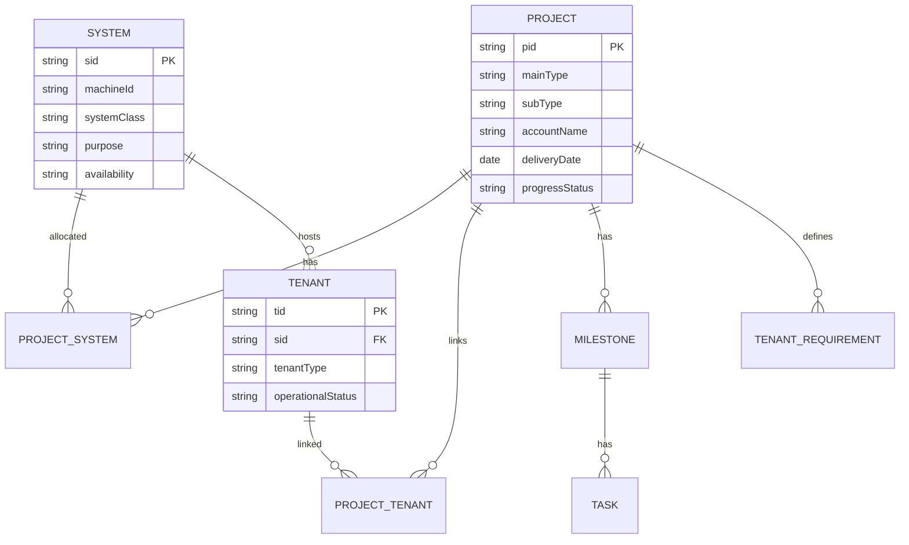
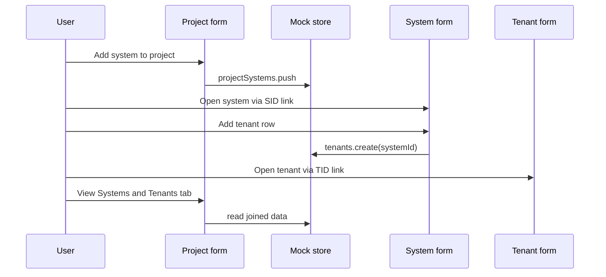
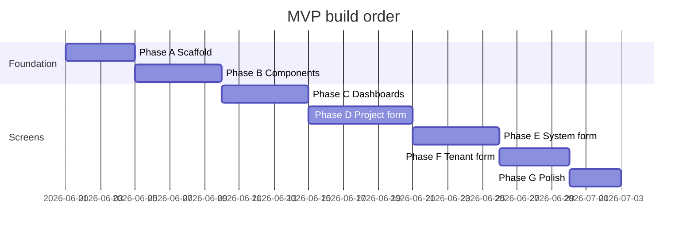

# MVP Implementation Plan — Delivery Project Management

**Version:** 1.0  
**Date:** 2026-05-25  
**Parent document:** [DESIGN.md](./DESIGN.md)  
**Strategy:** Mock/local data first · UI and relationships before automation

---

## 1. MVP goal

Deliver a **clickable, Salesforce-style prototype** that proves the three-object model (Project, System, Tenant) end-to-end:

- Three **list dashboards** with filter, search, and inline edit where appropriate  
- Three **record forms** with sticky header, tabs, and linked navigation (PID / SID / TID)  
- **Basic relationships** wired in local state (allocate system to project, attach tenant to system, link tenant to project)  
- **No advanced automation** (no SF sync, alerts engine, pool cut/paste, email, Octopus, or workflow guards beyond simple validation)

Success = a delivery specialist can demo: open Project list → open a project → see allocated systems and tenants → drill to System and Tenant forms → edit grid cells → changes persist in browser storage for the session.

---

## 2. In scope vs out of scope

### In scope

| Area | MVP delivery |
|------|----------------|
| **Project list dashboard** | Sortable/filterable table, key columns, link to form |
| **System list dashboard** | Same; SID/MID, purpose, linked PIDs |
| **Tenant list dashboard** | Same; TID, warranty summary columns |
| **Project form** | One consolidated form (all project types); type selector switches visible sections |
| **System form** | Customer + POC modes via type toggle |
| **Tenant form** | Customer + POC modes via type toggle |
| **Relationships** | Manual allocate/deallocate in UI; FK-style links in mock store |
| **Inline grids** | Milestones, tasks, tenants-on-system, requirements, engagement circles |
| **Navigation** | PID/SID/TID as links between list ↔ form |
| **Data** | JSON mock seed + in-memory store (optional `localStorage` persistence) |
| **Export** | CSV export from dashboards (client-side) |
| **UX shell** | App layout, sidebar nav, SF-inspired colors/status badges |

### Out of scope (defer to post-MVP)

| Area | Reason |
|------|--------|
| Salesforce / Opportunity sync | Automation |
| Production & POC **pool dashboards** | Advanced operational UI |
| Cut/paste · copy/paste allocation services | Automation |
| Auto-populate System & Tenant tab from renewal rules | Automation |
| Alerts (overdue delivery, POC overdue, warranty) | Automation |
| Email, Outlook, Freshdesk | Automation |
| Upgrade Scheduler | Separate module |
| Infrastructure tab (full) | Complexity |
| Usage tab | Not designed |
| Octopus integration | External |
| Full RBAC / field-level permissions | Use single “DS” role for MVP |
| Auth / SSO | Optional stub (“Logged in as Demo User”) |
| PostgreSQL / real API | Phase after UI validation |
| All 6 separate project form layouts | Single form + conditional sections for MVP |
| Warranty predecessor chain logic | Show static warranty rows only |
| Form audit log / “last changed by” | Simple `updatedAt` on mock records only |

---

## 3. Recommended stack (MVP)

| Layer | Choice | Why |
|-------|--------|-----|
| **App** | React 18 + TypeScript + Vite | Fast scaffold, good table ecosystem |
| **Routing** | React Router | List ↔ detail routes |
| **State** | Zustand (or React Context) | Simple mock CRUD without backend |
| **Tables** | TanStack Table v8 | Inline edit, sort, filter |
| **Forms** | React Hook Form + Zod | Header fields + grid row validation |
| **Styling** | Tailwind + small SF-token palette | Blue headers, status colors, dense grids |
| **Icons** | Lucide | Lightweight |
| **Persistence** | `src/data/seed.json` + optional `localStorage` | Mock-first per requirement |

**No backend for MVP.** API-shaped functions (`projectsApi.list()`) called against the local store so a real API can swap in later.

---

## 4. Minimal data model (mock)



### Core IDs (display keys)

| Entity | Example | Generated |
|--------|---------|-----------|
| Project | `P1042` | `P` + increment |
| System | `S1050` | `S` + increment (POC pool may use `MID` `p202` only until assigned) |
| Tenant | `T1201` | `T` + increment |

### Relationship tables (in mock store)

| Collection | Fields | MVP behavior |
|------------|--------|--------------|
| `projectSystems` | `projectId`, `systemId`, `allocatedAt` | User clicks “Add system” on project → pick from list → create row |
| `projectTenants` | `projectId`, `tenantId` | Set when tenant created from project context (optional for MVP) |
| `tenants.systemId` | FK | Required; tenant always on one system |

---

## 5. Mock data plan

### 5.1 Seed file structure

```
src/data/
  seed.json           # Initial load
  seed.types.ts       # TypeScript interfaces
  id-generator.ts     # PID/SID/TID helpers
```

### 5.2 Suggested seed volumes

| Entity | Count | Variety |
|--------|-------|---------|
| Projects | 12 | 2 POC, 4 Delivery (New/Upsell), 4 Renewal variants, 2 canceled |
| Systems | 15 | 8 production-assigned, 4 POC pool, 3 unallocated inventory |
| Tenants | 20 | Mix customer/POC; multi-tenant on 2 systems |
| Milestones | ~5 per project | Subset only on 4 projects |
| Tasks | ~3 per milestone | |
| Tenant requirements | 1–2 per project | Simplified rows |
| Warranties | 10 | Customer tenants only; static statuses |

### 5.3 Local store API (facade)

```typescript
// Example shape — implement in src/store/
projects.list(filters?)
projects.get(pid)
projects.update(pid, patch)
projects.create(dto)

systems.list(filters?)
systems.get(sid)
systems.allocateToProject(sid, pid)   // manual MVP
systems.deallocate(sid, pid)

tenants.list(filters?)
tenants.get(tid)
tenants.create(dto)                   // requires systemId
tenants.update(tid, patch)
tenants.moveToSystem(tid, newSid)     // dropdown, no drag-drop automation
```

Persist: `localStorage.setItem('dpm-mvp-v1', JSON.stringify(store))` on each mutation (optional toggle in dev menu).

---

## 6. Application routes

| Route | Screen |
|-------|--------|
| `/` | Redirect → `/projects` |
| `/projects` | Project list dashboard |
| `/projects/:pid` | Project form |
| `/systems` | System list dashboard |
| `/systems/:sid` | System form |
| `/tenants` | Tenant list dashboard |
| `/tenants/:tid` | Tenant form |

Global nav: **Projects** · **Systems** · **Tenants**

---

## 7. Screen specifications

### 7.1 Shared dashboard pattern

All three lists share one `DataDashboard` component:

| Feature | MVP implementation |
|---------|-------------------|
| Column headers | Config per entity |
| Quick search | Client-side substring match |
| Column filters | Dropdown of unique values (picklist style) |
| Sort | Click column header |
| Row count | “Showing N records” |
| Row click | Navigate to form |
| Status colors | CSS class from `progressStatus` / `operationalStatus` / `availability` |
| Export CSV | `papaparse` or manual join |
| Inline edit | Only on columns marked `editable: true` in config |

**Not in MVP dashboards:** group-by summaries, replace-all, custom saved views, region auto-filter.

### 7.2 Project list dashboard

| Column | Editable | Notes |
|--------|----------|-------|
| PID (link) | No | Primary key |
| Account | No | |
| Main type / Sub type | No | Badge |
| Delivery date | Yes | Date input |
| Progress status | Yes | Open / In progress / Done |
| # Systems | No | Computed from `projectSystems` |
| # Tenants | No | Computed |
| Deal owner | Yes | Text |

**Actions:** `+ New Project` (modal, minimal fields) · row → open form

### 7.3 System list dashboard

| Column | Editable | Notes |
|--------|----------|-------|
| SID (link) | No | |
| MID | No | POC pool |
| System class | No | Customer / POC-Demo-Training |
| Purpose / Availability | Yes | Picklist |
| Product type | No | |
| Linked PIDs | No | Comma-separated links |
| # Tenants | No | Computed |
| Operational status | Yes | Picklist |

**No warranty columns** on system list (per design).

### 7.4 Tenant list dashboard

| Column | Editable | Notes |
|--------|----------|-------|
| TID (link) | No | |
| SID (link) | No | Navigate to system |
| PID (link) | No | If linked |
| Account | No | |
| Tenant type | No | |
| Operational status | Yes | |
| Warranty status | No | Derived mock field |
| Warranty end | No | From first warranty record |
| Country / Time group | No | |

### 7.5 Project form

**Layout:** Sticky title `PID P1042` · dynamic header (2–3 column grid) · tabs

| Tab | Content | Inline grid |
|-----|---------|-------------|
| **Details** | Opportunity (read-only mock), account, delivery date, owners, progress, type selectors | No |
| **Requirements** | Simplified tenant requirement rows (product, hosting, licenses, features multi-select) | Yes |
| **Milestones & Tasks** | Combined or sub-tabs: milestone rows expand to tasks | Yes |
| **Systems & Tenants** | Allocated systems table (SID link, deallocate btn); tenants summary with TID links | Systems: actions only |
| **Engagement** | Role + name columns | Yes |
| **Remarks** | Free-text rows | Yes |

**Header actions:** Save · Cancel project (modal + reason, sets `canceledAt`) · Back to list

**MVP simplification:** One form component; `mainType` + `subType` dropdowns show/hide requirement sections (not six separate routes).

### 7.6 System form

| Tab | Content | Inline grid |
|-----|---------|-------------|
| **Details** | SID, class, purpose, availability, product, hosting, time group, linked PIDs (links) | No |
| **Tenants** | TID, account, status, product; Add tenant modal | Yes · Edit/Delete row |
| **Versions** | Version number, date, notes (customer systems) | Yes |
| **POC period** | Visible if POC class: start/end date | No |

**Actions:** Add tenant (modal: pick linked project requirement or free create) · Save

**Deferred tab:** Infrastructure, Usage, Documents, Purpose history (placeholder “Coming soon”)

### 7.7 Tenant form

| Tab | Content | Inline grid |
|-----|---------|-------------|
| **Configuration** | Product, hosting, licenses, feature checkboxes | No |
| **Warranties** | Customer only: start, end, status, type | Yes |
| **POC period** | POC only: start/end (read-only from project optional) | No |
| **Engagement** | Role, user name | Yes |
| **History** | Static read-only audit sample rows | No |

**Header:** TID · SID link · PID link · composite key display (`T1201-S1050-P1042` or “Not set yet”)

---

## 8. Relationship behaviors (manual MVP)

No background jobs. All relationship changes are **explicit UI actions**.



| Action | UI location | MVP rule |
|--------|-------------|----------|
| Allocate system → project | Project form · Systems & Tenants tab | Modal picklist of systems not already on this project |
| Remove system from project | Same tab | Confirm → remove `projectSystems` row (tenant rows stay on system) |
| Create tenant on system | System form · Tenants tab | Requires `systemId`; optional `projectId` |
| Link tenant → project | On tenant create or edit | Optional `projectTenants` row |
| Move tenant to another system | Tenant form header or System grid | Dropdown of systems; update `tenant.systemId` |
| Navigate cross-entity | Any PID/SID/TID | React Router link |

**Validation (simple, not automation):**

- Block save if tenant `productType` ≠ system `productType` (toast error)  
- Warn (confirm dialog) if tenant `timeGroup` ≠ system `timeGroup`; allow continue  

---

## 9. Inline editable grids

### 9.1 Shared `EditableGrid` component

| Capability | MVP |
|------------|-----|
| Cell types | text, number, date, select, multi-select, checkbox |
| Add row | Button below grid |
| Delete row | Icon per row |
| Save model | Row-level commit on blur or explicit Save on form |
| Read-only columns | Config flag |

### 9.2 Grids by surface

| Surface | Grid | Editable columns |
|---------|------|------------------|
| Project list | Main table | delivery date, progress, owner |
| System list | Main table | purpose, availability, operational status |
| Tenant list | Main table | operational status |
| Project form | Requirements | product, hosting, licenses, features |
| Project form | Milestones | name, status, deadline |
| Project form | Tasks | name, status, deadline |
| Project form | Engagement | role, user |
| System form | Tenants | operational status, account ref |
| System form | Versions | version, date, note |
| Tenant form | Warranties | start, end, status, type |
| Tenant form | Engagement | role, user |

---

## 10. UI / SF-style checklist

| Element | MVP target |
|---------|------------|
| Page header band | Brand blue bar + record title |
| Record header | 2–3 column field groups with subtle section labels |
| Tabs | Underline tab bar, white content panel |
| Tables | Compact row height, zebra optional, hover highlight |
| Status badges | Open = gray, In progress = blue, Done = green, Overdue = red (static, no auto calc) |
| Links | PID/SID/TID in brand link color |
| Toast | Save success / validation errors |
| Loading | Skeleton rows (fake 300ms delay optional for realism) |

---

## 11. Implementation phases (trimmed)

Total estimate: **6–8 weeks** (one developer) or **3–4 weeks** (two developers).

### Phase A — Scaffold (3–4 days)

| Task | Output |
|------|--------|
| A.1 | Vite + React + TS + Tailwind + Router |
| A.2 | SF theme tokens + `AppShell` (sidebar, top bar) |
| A.3 | TypeScript types + `seed.json` |
| A.4 | Zustand store + persistence hook |
| A.5 | API facade (`/src/api/*.ts`) |

### Phase B — Shared components (4–5 days)

| Task | Output |
|------|--------|
| B.1 | `DataDashboard` (table, search, filter, sort, CSV) |
| B.2 | `EditableGrid` |
| B.3 | `RecordHeader` (sticky title + field groups) |
| B.4 | `TabPanel` · `StatusBadge` · `LinkId` |
| B.5 | `Picklist` · `DateField` · confirm modal |

### Phase C — Dashboards (4–5 days)

| Task | Output |
|------|--------|
| C.1 | Project list + column config + inline edit |
| C.2 | System list |
| C.3 | Tenant list |
| C.4 | `+ New` modals (minimal create) |
| C.5 | Dashboard → form routing |

### Phase D — Project form (5–6 days)

| Task | Output |
|------|--------|
| D.1 | Shell + header fields |
| D.2 | Type-based section visibility (POC / Delivery / Renewal) |
| D.3 | Requirements grid |
| D.4 | Milestones + tasks grids |
| D.5 | Systems & Tenants tab (allocate modal) |
| D.6 | Engagement + remarks grids |
| D.7 | Save / cancel project |

### Phase E — System form (4–5 days)

| Task | Output |
|------|--------|
| E.1 | Details tab + linked PIDs |
| E.2 | Tenants grid + add tenant modal |
| E.3 | Versions grid |
| E.4 | POC period section (conditional) |
| E.5 | Product/time-group validation on tenant add |

### Phase F — Tenant form (3–4 days)

| Task | Output |
|------|--------|
| F.1 | Configuration tab |
| F.2 | Warranties grid (customer) / POC dates |
| F.3 | Engagement grid |
| F.4 | Header links + move-system dropdown |
| F.5 | Sample history tab (read-only) |

### Phase G — Polish & demo (2–3 days)

| Task | Output |
|------|--------|
| G.1 | Cross-link QA (all PID/SID/TID paths) |
| G.2 | Seed data narrative (one demo account, one POC flow) |
| G.3 | README: run instructions + demo script |
| G.4 | Empty states + basic error boundaries |



---

## 12. Suggested project structure

```
delivery-project-management/
├── DESIGN.md
├── MVP-PLAN.md
├── README.md
├── package.json
├── index.html
├── vite.config.ts
├── tailwind.config.js
└── src/
    ├── main.tsx
    ├── App.tsx
    ├── routes/
    │   └── index.tsx
    ├── layouts/
    │   └── AppShell.tsx
    ├── pages/
    │   ├── projects/
    │   │   ├── ProjectListPage.tsx
    │   │   └── ProjectFormPage.tsx
    │   ├── systems/
    │   │   ├── SystemListPage.tsx
    │   │   └── SystemFormPage.tsx
    │   └── tenants/
    │       ├── TenantListPage.tsx
    │       └── TenantFormPage.tsx
    ├── components/
    │   ├── dashboard/DataDashboard.tsx
    │   ├── grid/EditableGrid.tsx
    │   ├── record/RecordHeader.tsx
    │   ├── record/TabPanel.tsx
    │   └── ui/...
    ├── api/
    │   ├── projects.ts
    │   ├── systems.ts
    │   └── tenants.ts
    ├── store/
    │   └── useAppStore.ts
    ├── data/
    │   ├── seed.json
    │   ├── seed.types.ts
    │   └── id-generator.ts
    ├── config/
    │   ├── project-columns.ts
    │   ├── system-columns.ts
    │   └── tenant-columns.ts
    └── utils/
        ├── csv-export.ts
        └── validators.ts
```

---

## 13. Definition of done (MVP)

| # | Criterion |
|---|-----------|
| 1 | All three dashboards load seed data, support search + at least one column filter |
| 2 | Inline edit on dashboard columns marked editable persists in local store |
| 3 | Project, System, and Tenant forms open from list and from cross-links |
| 4 | User can allocate a system to a project and see it on Systems & Tenants tab |
| 5 | User can add a tenant on a system and open it from Tenant list |
| 6 | Milestones/tasks and at least two other grids support add/edit/delete row |
| 7 | Product-type mismatch blocks tenant save with visible error |
| 8 | CSV export works on each dashboard |
| 9 | Data survives page refresh when localStorage persistence enabled |
| 10 | README documents `npm install` / `npm run dev` and a 5-minute demo path |

---

## 14. Post-MVP migration path

When MVP is approved, swap layers in order (see [DESIGN.md §8](./DESIGN.md#8-implementation-phases)):

1. **PostgreSQL + API** — replace store facade; keep same TypeScript types  
2. **Real allocation service** — cut/paste and copy/paste rules  
3. **Six project form variants** — metadata from Excel  
4. **Alerts and automation** — overdue, auto-populate tabs  
5. **Salesforce Opportunity integration**  
6. **Pool dashboards + Infrastructure + Upgrade Scheduler**

---

## 15. Demo script (5 minutes)

1. Open **Project list** → sort by delivery date → inline-edit progress to “In progress”.  
2. Open **P1042** (Delivery – New) → Requirements tab → add a row.  
3. **Systems & Tenants** tab → allocate **S1050** → click SID → System form.  
4. **Tenants** tab → add tenant → save → click TID → Tenant form.  
5. **Warranties** tab → edit end date inline.  
6. Navigate **Tenant list** → confirm row appears with warranty columns.  
7. Export Project list to CSV.

---

## Document history

| Version | Date | Changes |
|---------|------|---------|
| 1.0 | 2026-05-25 | Initial trimmed MVP plan |

---

*End of MVP plan*
